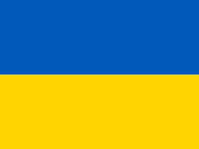

# Image Blending

&nbsp; **Pray for Ukraine**


### \<List>

- [Image Blending (2022.02.27)](#image-blending-20220227)


## [Image Blending (2022.02.27)](#list)
- A practice to blend two images by using `cv2`
- Generate Ukrainian flag with `numpy`
- Reference ☞ https://opencv-python.readthedocs.io/

#### ImageBlending.py
```py
# 0. Import libraries
import cv2                                                                      # install "opencv-python", but import "cv2"
import numpy as np                                                              # for using np.full()
import matplotlib.pyplot as plt
```
```py
# 1. Call img1
path = "Images/UkrainianPresidentZelenskyy.png"                                 # ★ input your image ★
img1 = cv2.imread(path, cv2.IMREAD_COLOR)
# cv2.imshow("image", img1)                                                     # test : ok
# cv2.waitKey(0)
```

```py
# 2. Call img2 : generate an Ukrainian flag to fit with the img1's size
h, w, c = img1.shape
# print(h, w, c)                                                                # test : ok
h2_1 = int(h/2)                                                                 # h/2 without int() returns float, that occurs error in np.full()
h2_2 = h - h2_1
sapphire = (0xBB, 0x5B, 0x00)                                                   # Ukrainian flag color 1 : not RGB, but BGR
cyberYellow = (0x00, 0xD5, 0xFF)                                                # Ukrainian flag color 2 : not RGB, but BGR
img2_1 = np.full((h2_1, w, 3), sapphire, dtype=np.uint8)                        # not "unit8"!
img2_2 = np.full((h2_2, w, 3), cyberYellow, dtype=np.uint8)
img2 = cv2.vconcat([img2_1, img2_2])
# cv2.imshow("image", img2)                                                     # test : ok
# cv2.waitKey(0)
cv2.imwrite("Images/UkrainianFlag.png", img2)
```

```py
# 3. Blend two images and save it
alpha = 0.5
img3 = cv2.addWeighted(img1, alpha, img2, 1 - alpha, 0)
cv2.imshow("image", img3)
cv2.waitKey(0)
cv2.imwrite("Images/UkrainianFlagBlended.png", img3)
```

```py
# 3.1 Show images on multiple figures
fig = plt.figure()
rows = 1; cols = 3
ax1 = fig.add_subplot(rows, cols, 1)
ax1.imshow(img1)
ax2 = fig.add_subplot(rows, cols, 2)
ax2.imshow(img2)
ax3 = fig.add_subplot(rows, cols, 3)
ax3.imshow(img3)
plt.show()                                                                      # crazy colors
```
