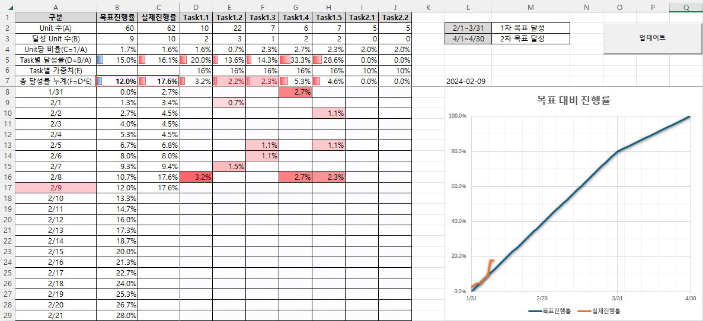

# [Empty Cells (Excel VBA)](../../README.md#vba)

  I want a prettier chart


### \<List>

  - [Empty Cells (2024.02.09)](#empty-cells-20240209)


## [Empty Cells (2024.02.09)](#list)

  - Features
    - Prevent `""` returned from excel formula from being regarded as `0` in the chart
    - ★ The cleanest handling of **magic literals** in my VBA coding history! ★
      ```vba
      Private Const START_ROW As Long = 8                         ' The starting row where data begins
      Private Const DATE_COLUMN As String = "A"                   ' The column letter for the date column
      Private Const RATE_COLUMN As String = "C"                   ' The column letter for the column where sum will be displayed
      Private Const DATA_START_COLUMN As String = "D"             ' The column letter where data starts
      Private Const DATA_END_COLUMN As String = "J"               ' The column letter where data ends
      ```

  - Output
    <details>
      <summary>Before</summary>

      `C9` : `=IF(TODAY()>=A9,SUM(D9:J9)+C8,"")`

      

      `C9` : `=SUM(D9:J9)+C8`

      
    </details>
    <details open="">
      <summary>After</summary>

      
    </details>

  - Future Improvements
    - Gather the calculation results into an array and write them on the sheet at once
    - Translate additional parts relying on Excel functions into VBA code

  - Codes
    <details>
      <summary>Codes : EmptyCells.bas</summary>

    ```vba
    Option Explicit
    ```
    ```vba
    Private Const START_ROW As Long = 8                         ' The starting row where data begins
    Private Const DATE_COLUMN As String = "A"                   ' The column letter for the date column
    Private Const RATE_COLUMN As String = "C"                   ' The column letter for the column where sum will be displayed
    Private Const DATA_START_COLUMN As String = "D"             ' The column letter where data starts
    Private Const DATA_END_COLUMN As String = "J"               ' The column letter where data ends
    ```
    ```vba
    Private Sub UpdateSumValues()
        ' Summary: Main procedure to update the sums
        
        Dim ws As Worksheet                                     ' The current worksheet
        Dim lastRow As Long                                     ' The last row where data exists
        Dim rateRange As String                                 ' The range where sums will be displayed

        ' Set the current active sheet
        Set ws = ThisWorkbook.ActiveSheet

        ' Find the last row where data exists
        lastRow = ws.Cells(ws.Rows.Count, DATE_COLUMN).End(xlUp).Row

        ' Set and clear the range where sums will be displayed
        rateRange = RATE_COLUMN & START_ROW & ":" & RATE_COLUMN & lastRow
        ws.Range(rateRange).ClearContents

        ' Get the current date
        Dim currentDate As Date
        currentDate = Date

        ' Iterate through each row to calculate and assign sums
        Dim i As Long
        For i = START_ROW To lastRow
            If ws.Cells(i, DATE_COLUMN).Value <= currentDate Then
                Call CalculateAndAssignSum(ws, i)
            End If
        Next i

    End Sub
    ```
    ```vba
    Private Sub CalculateAndAssignSum(ws As Worksheet, rowNumber As Long)
        ' Summary: Procedure to calculate and assign sum for each row
        
        Dim sumValue As Double                                  ' Variable to store the sum value
        Dim dataRange As Range                                  ' Range where data exists

        ' Set the range where data exists
        Set dataRange = ws.Range(DATA_START_COLUMN & rowNumber & ":" & DATA_END_COLUMN & rowNumber)

        ' Calculate sum including sum from previous row if applicable
        If rowNumber > START_ROW Then
            sumValue = Application.WorksheetFunction.Sum(dataRange) + _
                      Application.WorksheetFunction.Sum(ws.Range(RATE_COLUMN & (rowNumber - 1)))
        Else
            ' Calculate sum excluding sum from previous row for the first row
            sumValue = Application.WorksheetFunction.Sum(dataRange)
        End If

        ' Assign the sum value to the respective column in the current row
        ws.Cells(rowNumber, RATE_COLUMN).Value = sumValue

    End Sub
    ```
    ```vba
    Private Sub btnUpdate_Click()
        ' Summary: Procedure called when the update button is clicked
        
        ' Change calculation to manual for performance improvement
        Application.Calculation = xlManual
            Call UpdateSumValues
        Application.Calculation = xlAutomatic

    End Sub
    ```
    </details>
