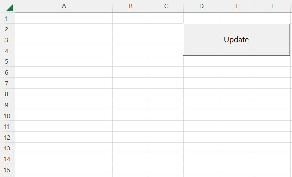

# [List Sheet Names (Excel VBA)](../../README.md#vba)

  List All Sheet Names in the Excel Workbook


### \<List>

  - [List Sheet Names (2023.11.15)](#list-sheet-names-20231115)


## [List Sheet Names (2023.11.15)](#list)

  

  - Features
    - Retrieves all sheet names in the active workbook and prints them in a column
    - Can activate a specific sheet when click

  - Issues
    - Do not return an error even if the `Target.Value` isn’t accurately received (Solved)

  - Future Improvements
    - Sort the sheets
    - Modify the sheet names at once

  - Codes
    <details>
      <summary>Codes : ListSheetNames.bas</summary>

    ```vba
    Option Explicit
    ```
    ```vba
    Private Sub GetAllSheetNames()

        Dim ws As Worksheet
        Dim sheetNames() As String
        Dim i As Integer

        ' Resize the array to the number of sheets in the workbook
        ReDim sheetNames(1 To Sheets.Count)

        ' Loop through each worksheet and store its name in the array
        For Each ws In ThisWorkbook.Sheets
            i = i + 1
            sheetNames(i) = ws.Name
            ' Debug.Print sheetNames(i)                         ' For debugging purposes
        Next ws

        ' Output sheet names in a column in the active sheet without a loop
        Range("A1").Resize(UBound(sheetNames), 1).Value = Application.Transpose(sheetNames)

    End Sub
    ```
    ```vba
    Private Sub Worksheet_SelectionChange(ByVal Target As Range)

        If Target.Cells.CountLarge = 1 Then ' Checking if only a single cell is selected
            Dim wsName As String
            wsName = Target.Value ' Store the value of the selected cell

            ' If a sheet with the given name exists, activate it
            If WorksheetExists(wsName) Then
                Sheets(wsName).Activate
            End If
        End If

    End Sub
    ```
    ```vba
    Function WorksheetExists(wsName As String) As Boolean

        ' Check if a sheet with the given name exists
        On Error Resume Next
            WorksheetExists = Not Sheets(wsName) Is Nothing
        On Error GoTo 0

    End Function
    ```
    ```vba
    Private Sub btn_GetAllSheetNames_Click()

        ' Clear data in column A
        Columns("A:A").Clear

        ' Execute the GetAllSheetNames function
        Call GetAllSheetNames

    End Sub
    ```

    </details>
