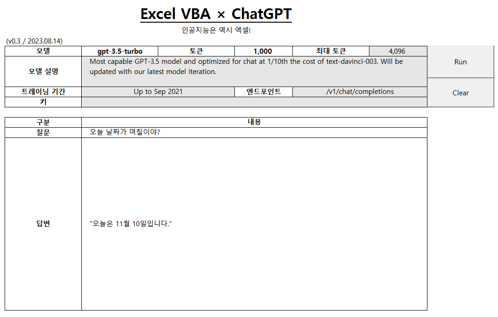
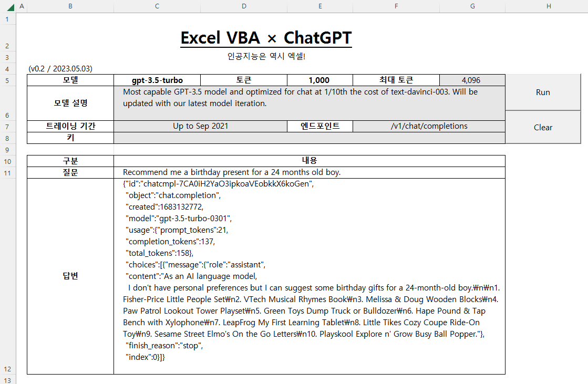

# [Q&A with ChatGPT (Excel VBA)](../../README.md#vba)

AI is definitely Excel material!


### \<List>

- [Q&A with ChatGPT v0.3 (2023.08.14)](#qa-with-chatgpt-v03-20230814)
- [Q&A with ChatGPT v0.2 (2023.05.03)](#qa-with-chatgpt-v02-20230503)


## [Q&A with ChatGPT v0.3 (2023.08.14)](#list)

- Features : Successfully received unicode string in Korean
  - Click [Run] Button
  - Run *python* code by `Shell` command
    - Request an answer to *ChatGPT* API and receive it into an external `yml` file as `utf-8-sig`
  - Parse the answer string from the `yml` file

  

- Future Improvements
  - Use `xlwings` instead of `openpyxl` so that you can interact with Excel sheet in real time without the need to transfer an external `yml` file between *VBA* and *Python*
    - Reference : [Update an Excel sheet in real time using Python (Stack Overflow)](https://stackoverflow.com/questions/50411346/update-an-excel-sheet-in-real-time-using-python)

- Codes
  <details>
    <summary>QAWithChatGPT_0.3.py (New)</summary>

  ```py
  import pprint
  import openpyxl
  import requests
  import yaml
  ```
  ```py
  # 경로 설정
  FILE_PATH       = "./QAWithChatGPT.xlsm"
  SHEET_NAME      = "ChatGPT0.3"
  SAVE_FILE_PATH  = "./QAWithChatGPT_V0.3.yml"

  # 엑셀 파일 불러오기
  wb          = openpyxl.load_workbook(FILE_PATH)
  ws          = wb[SHEET_NAME]

  # 엑셀에서 데이터 불러오기
  model       = ws["C5"].value
  tokens      = ws["E5"].value
  endpoint    = ws["F7"].value
  api_key     = ws["C8"].value
  question    = ws["C11"].value
  ```
  ```py
  # Json 요청 데이터 생성
  request_data = {
      "model"     : model,
      "messages"  : [
          {
              "role"      : "system",
              "content"   : "You are a helpful assistant."
          },
          {
              "role"      : "user",
              "content"   : question
          }
      ],
      "max_tokens": tokens,
      "n"         : 1
  }

  headers = {
      "Content-Type"  : "application/json",
      "Authorization" : f"Bearer {api_key}"
  }
  ```
  ```py
  # ChatGPT API 요청
  url         = f"https://api.openai.com{endpoint}"
  response    = requests.post(url, json=request_data, headers=headers, timeout=5)
  answer      = response.json()
  # content   = answer['choices'][0]['message']['content']
  # print("content(raw)         :", content)
  ```
  ```py
  # YAML 파일로 저장
  with open(SAVE_FILE_PATH, "w", encoding='utf-8') as file:
      yaml.dump(answer, file)
  ```
  ```py
  # 테스트
  if __name__ == '__main__':
      pprint.pprint(request_data)
      print()
      pprint.pprint(response.json())
      print()
  ```
  </details>
  <details>
    <summary>QAWithChatGPT_0.3.bas (Improved)</summary>

  ```vba
  Option Explicit
  ```
  ```vba
  Private Type ParametersType

      ' Worksheet에서 범위로 선언
      ws              As Worksheet
      modelRange      As Range
      tokensRange     As Range
      maxTokensRange  As Range
      questionRange   As Range
      answerRange     As Range

      currentFilePath As String
      pythonExe       As String
      pythonArgs      As String
      ymlFilePath     As String

  End Type
  ```
  ```vba
  ' 파라미터 설정 프로시저
  Private Sub SetParameters(ByRef thisType As ParametersType)

      ' `Set` 키워드 누락 주의!
      Set thisType.ws = ThisWorkbook.Sheets("ChatGPT0.3")
      Set thisType.modelRange = Range("C5")
      Set thisType.tokensRange = Range("E5")
      Set thisType.maxTokensRange = Range("G5")
      Set thisType.questionRange = Range("C11")
      Set thisType.answerRange = thisType.ws.Range("C12")

      thisType.currentFilePath = ThisWorkbook.path
      thisType.pythonExe = "C:\Python\Python38-64\python.exe"
      thisType.pythonArgs = ".\QAWithChatGPT_V0.3.py"
      thisType.ymlFilePath = ".\QAWithChatGPT_V0.3.yml"

  End Sub
  ```
  ```vba
  ' 유니코드 문자열 파싱 프로시저
  Private Function ParseUnicodeString(ByRef inputString As String) As String

      Dim replacedString  As String
      Dim parsedString    As String
      Dim splitArray()    As String
      Dim i               As Integer

      ' \u를 공백으로 대체하고 "를 제외한 문자열로 수정
      replacedString = Replace(inputString, " ", " \nbsp ")
      replacedString = Replace(replacedString, "\u", " ")

      ' 수정된 문자열을 공백으로 나눠서 배열에 담기
      splitArray = Split(replacedString, " ")

      ' 배열 내용 출력
      parsedString = ""
      For i = LBound(splitArray) To UBound(splitArray)
          Debug.Print i & " : " & splitArray(i)
          If Len(splitArray(i)) = 4 Then
              parsedString = parsedString & ChrW("&H" & Left(splitArray(i), 4))
          ElseIf Len(splitArray(i)) >= 5 Then
              If splitArray(i) = "\nbsp" Then
                  parsedString = parsedString & " "
              Else
                  parsedString = parsedString & ChrW("&H" & Left(splitArray(i), 4))
                  parsedString = parsedString & Mid(splitArray(i), 5, Len(splitArray(i)) - 4)
              End If
          Else
              parsedString = parsedString & splitArray(i)
          End If
      Next i

      ParseUnicodeString = parsedString

  End Function
  ```
  ```vba
  ' YAML 내용 읽어서 표시하는 프로시저
  Private Sub ReadAndDisplayYAMLContent(ByRef thisType As ParametersType)

      Dim ws              As Worksheet

      Dim fileName        As String
      Dim fileContent     As String
      Dim content         As String
      Dim parsedContent   As String
      Dim regex           As Object
      Dim matches         As Object

      ' 외부 YAML 파일 경로
      fileName = thisType.currentFilePath & thisType.ymlFilePath
      Debug.Print "fileName : " & fileName                                        ' ok

      ' 외부 파일 읽기
      With CreateObject("Scripting.FileSystemObject")
          If .FileExists(fileName) Then
              fileContent = .OpenTextFile(fileName).ReadAll
          Else
              MsgBox "File not found"
              Exit Sub
          End If
      End With

      ' 정규식 객체 생성
      Set regex = CreateObject("VBScript.RegExp")
      regex.Global = True
      regex.IgnoreCase = True
      regex.Pattern = "content: (.+)"

      ' 정규식 패턴과 일치하는 부분 찾기
      Set matches = regex.Execute(fileContent)

      ' 일치하는 내용 추출
      If matches.Count > 0 Then
          content = matches(0).SubMatches(0)
          Debug.Print "content : " & content
          parsedContent = ParseUnicodeString(content)
          thisType.answerRange.Value = parsedContent
          ' ThisWorkbook.Save                                                     ' 파일 저장
          ' MsgBox "Content displayed and file saved successfully."
      Else
          MsgBox "Content not found"
      End If

  End Sub
  ```
  ```vba
  ' 실행 버튼 클릭 이벤트 핸들러
  Private Sub btnRun_Click()

      Application.Calculation = xlManual

          Dim Parameters As ParametersType
          Call SetParameters(Parameters)

          If Parameters.modelRange.Value = "" Then
              Parameters.answerRange.Value = "모델을 선택해주세요."
          ElseIf Parameters.questionRange.Value = "" Then
              Parameters.answerRange.Value = "질문을 입력해주세요."
          ElseIf Parameters.tokensRange.Value = "" Then
              Parameters.answerRange.Value = "토큰 수를 입력해주세요(< 최대 토큰)."
          ElseIf (Parameters.maxTokensRange.Value <> "auto") And _
              (CInt(Parameters.tokensRange.Value) > CInt(Parameters.maxTokensRange.Value)) Then
              Parameters.answerRange.Value = "설정한 토큰 수가 최대 토큰 수보다 많습니다."
          Else
              Debug.Print "Shell : " & Parameters.pythonExe & " " & Parameters.pythonArgs
              Shell Parameters.pythonExe & " " & Parameters.pythonArgs
              Call ReadAndDisplayYAMLContent(Parameters)
          End If

      Application.Calculation = xlAutomatic

  End Sub
  ```
  ```vba
  ' 초기화 버튼 클릭 이벤트 핸들러
  Private Sub btnClear_Click()

      Application.Calculation = xlManual

          Dim CellLocations As CellLocationsType
          Call SetCellLocations(CellLocations)

          CellLocations.tokensRange.Value = ""
          CellLocations.questionRange.Value = ""
          CellLocations.answerRange.Value = ""

      Application.Calculation = xlAutomatic

  End Sub
  ```
  </details>
  <details>
    <summary>QAWithChatGPT_0.3.yml (Results)</summary>

  ```yml
  choices:
  - finish_reason: stop
    index: 0
    message:
      content: "\uC624\uB298\uC740 {{\uC624\uB298 \uB0A0\uC9DC}}\uC77C\uC774\uC5D0\uC694\
        ."
      role: assistant
  created: 1691996504
  id: chatcmpl-7nLs8l2pC4rBdXHSL590KEM4LEdOA
  model: gpt-3.5-turbo-0613
  object: chat.completion
  usage:
    completion_tokens: 18
    prompt_tokens: 32
    total_tokens: 50
  ```
  </details>


## [Q&A with ChatGPT v0.2 (2023.05.03)](#list)

- Features
  - Succeed in obtaining responses for some models of the `/v1/chat/completions` endpoint.
  - Call the max token value, descrition, training period of the chosen model automatically  
  (not with VBA, but with the excel function `vlookup()`)

  

- Future Improvements
  - Resolve struggles related to *JSON*
    - Extract and refine `content` → [*Done*](#qa-with-chatgpt-v03-20230814)
    - Print Korean characters properly → [*Done*](#qa-with-chatgpt-v03-20230814)
    - Output other parameters separately in individual cells
  - Support more various models that require different parameters to each other
  - Improve the speed of the feature that detects model changes and automatically adjusts the initial token value to be no greater than the maximum

- Where is the previous version? (crazy ad hoc documentation)  
  ☞ [kimpro82/MyPractice](https://github.com/kimpro82/MyPractice) > [Simple Q&A with ChatGPT : Trial (2023.05.02)](https://github.com/kimpro82/MyPractice/blob/master/VBA/README.md#simple-qa-with-chatgpt--trial-20230502)

- Codes
  <details>
    <summary>QAWithChatGPT_0.2.bas</summary>

  ```vba
  Option Explicit
  ```
  ```vba
  Private Type CellLocationsType

      model As String
      tokens As String
      maxTokens As String
      description As String
      trainingPeriod As String
      endpoint As String
      apiKey As String
      question As String

      ' Declare neither as String nor Integer but as Range
      modelRange As Range
      tokensRange As Range
      maxTokensRange As Range
      questionRange As Range
      answerRange As Range

  End Type
  ```
  ```vba
  Private Sub SetCellLocations(ByRef thisType As CellLocationsType)

      thisType.model = Range("C5").Value
      thisType.tokens = Range("E5").Value
      thisType.maxTokens = Range("G5").Value
      thisType.description = Range("C6").Value
      thisType.trainingPeriod = Range("C7").Value
      thisType.endpoint = Range("F7").Value
      thisType.apiKey = Range("C8").Value
      thisType.question = Range("C11").Value

      ' Don't forget `set`!
      Set thisType.modelRange = Range("C5")
      Set thisType.tokensRange = Range("E5")
      Set thisType.maxTokensRange = Range("G5")
      Set thisType.questionRange = Range("C11")
      Set thisType.answerRange = Range("C12")

  End Sub
  ```
  ```vba
  Private Sub ChatGPT()

      Dim CellLocations As CellLocationsType
      Dim request As Object
      Dim request_body As String
      Dim response As String

      ' Set required data
      Call SetCellLocations(CellLocations)

      ' Request ChatGPT API
      Set request = CreateObject("WinHttp.WinHttpRequest.5.1")
      request.Open "POST", "https://api.openai.com/" & CellLocations.endpoint, False
      request.SetRequestHeader "Content-Type", "application/json"
      request.SetRequestHeader "Authorization", "Bearer " & CellLocations.apiKey
      
  '    request_body = "{" & _
  '        """prompt"": """ & Replace(CellLocations.question, """", "\""") & """," & _
  '        """model"": """ & CellLocations.model & """," & _
  '        """max_tokens"": " & CInt(CellLocations.tokens) & "," & _
  '        """n"": 1," & _
  '        """stop"": [""\n""]" & _
  '    "}"

      request_body = "{" & _
          """model"": """ & CellLocations.model & """, " & _
          """messages"": [{" & _
              """role"": ""user"", " & _
              """content"": """ & Replace(CellLocations.question, """", "\""") & """" & _
          "}], " & _
          """max_tokens"": " & CInt(CellLocations.tokens) & ", " & _
          """n"": 1 " & _
      "}"
          Debug.Print "request_body = " & request_body
      request.send (request_body)
      
      ' Output
  '    response = Replace(request.responseText, Chr(34), "")
      response = Replace(request.responseText, ",", "," & Chr(10) & " ")
          Debug.Print "response = " & response & "\n"
      CellLocations.answerRange.Value = response

  End Sub
  ```
  ```vba
  ' But "surprisingly" late to use
  'Private Sub Worksheet_SelectionChange(ByVal Target As Range)
  '
  '    Dim CellLocations As CellLocationsType
  '    Call SetCellLocations(CellLocations)
  '
  '    If Not Intersect(CellLocations.modelRange, Target) Is Nothing Then
  '
  '        CellLocations.model = CellLocations.modelRange.Value
  '            Debug.Print "Changed in " & CellLocations.modelRange.Address & " : " & CellLocations.model
  '        CellLocations.maxTokens = CellLocations.maxTokensRange.Value
  '        If CInt(CellLocations.tokens) > CInt(CellLocations.maxTokens) Then
  '            CellLocations.tokensRange.Value = CellLocations.maxTokens           ' Set tokens = maxTokens as default
  '        End If
  '
  '    End If
  '
  'End Sub
  ```
  ```vba
  Private Sub btnRun_Click()

      Application.Calculation = xlManual

          Dim CellLocations As CellLocationsType
          Call SetCellLocations(CellLocations)

          If CellLocations.model = "" Then
              CellLocations.answerRange.Value = "모델을 선택해주세요."
          ElseIf CellLocations.question = "" Then
              CellLocations.answerRange.Value = "질문을 입력해주세요."
          ElseIf CellLocations.tokens = "" Then
              CellLocations.answerRange.Value = "토큰 수를 입력해주세요(< 최대 토큰)."
          ElseIf (CellLocations.maxTokens <> "auto") And _
              (CInt(CellLocations.tokens) > CInt(CellLocations.maxTokens)) Then
              CellLocations.answerRange.Value = "설정한 토큰 수가 최대 토큰 수보다 많습니다."
          Else
              Call ChatGPT
          End If
      
      Application.Calculation = xlAutomatic

  End Sub
  ```
  ```vba
  Private Sub btnClear_Click()

      Application.Calculation = xlManual

          Dim CellLocations As CellLocationsType
          Call SetCellLocations(CellLocations)

          CellLocations.modelRange.Value = ""
          CellLocations.tokensRange.Value = ""
          CellLocations.questionRange.Value = ""
          CellLocations.answerRange.Value = ""

      Application.Calculation = xlAutomatic

  End Sub
  ```
  </details>