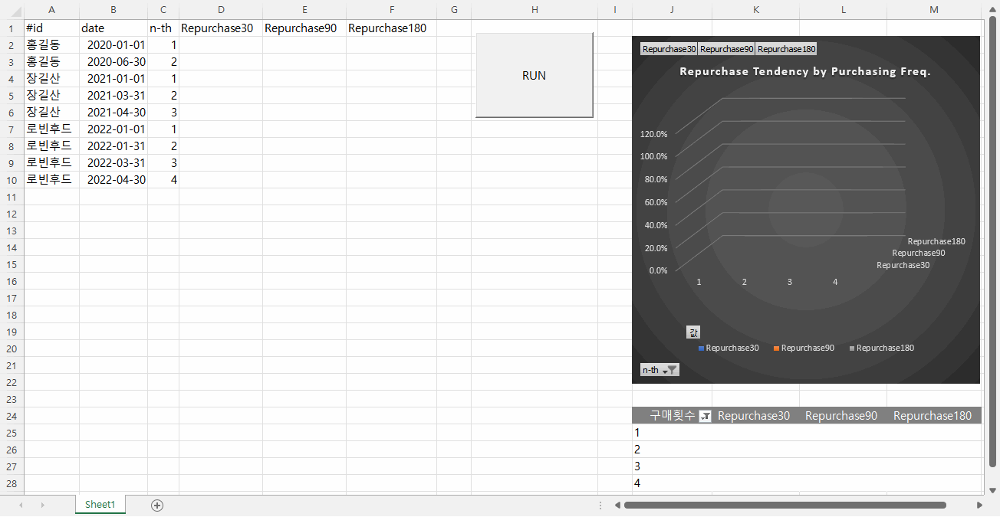

# Repurchase Tendency

for my friend JW Park


### \<List>

- [Repurchase Tendency (2022.06.10)](#repurchase-tendency-20220610)


## [Repurchase Tendency (2022.06.10)](#list)

- Find Repurchase Rate within 30/90/180 days by the Number of Repurchase
- Refresh the Pivot Table and Chart automatically



#### RepurchaseTendency.bas
```vba
' Set the zero point of data / ★ dependent on the sheet's figure
Private Sub SetZero( _
    ByRef dataZero As Range, _
    ByRef printZero As Range _
    )

    Set dataZero = Range("A2")
    Set printZero = Range("D2")

End Sub
```
```vba
' Get the range of the data / ★ dependent on the sheet's figure
Private Sub GetRange( _
    ByRef row As Integer, _
    ByRef col As Integer, _
    dataZero As Range _
    )

    With Sheet1.UsedRange
        row = Sheet1.Cells(Rows.Count, 1).End(xlUp).row - dataZero.row + 1
        col = 3
        ' col = Sheet1.Cells(1, Columns.Count).End(xlToLeft).Column - dataZero.Column + 1
    End With

End Sub
```
```vba
' Clear Using Area
Private Sub ClearArea( _
    ByRef printZero As Range, _
    ByRef row As Integer, _
    ByRef col As Integer _
    )

    Range(printZero, Cells(printZero.row + row - 1, printZero.Column + 2)).ClearContents

End Sub
```
```vba
' Get printArea()
Private Sub GetPrintArea( _
    ByRef printArea() As Range, _
    ByRef printZero As Range, _
    ByRef i As Integer _
    )

    Set printArea(0) = printZero.Offset(i, 0)
    Set printArea(1) = printZero.Offset(i, 1)
    Set printArea(2) = printZero.Offset(i, 2)

End Sub
```
```vba
' Get 1 or 0 according if Repurchase
Private Sub GetRepurchase( _
    ByRef dataZero As Range, _
    ByRef printArea() As Range, _
    ByRef i As Integer, _
    ByRef diff As Integer _
    )

    diff = dataZero.Offset(i, 1).Value - dataZero.Offset(i - 1, 1).Value
    ' Debug.Print diff

    ' I'm not sure a little ……
    If diff <= 30 Then
        printArea(0).Value = 1
        printArea(1).Value = 1
        printArea(2).Value = 1
    ElseIf diff <= 90 Then
        printArea(0).Value = 0
        printArea(1).Value = 1
        printArea(2).Value = 1
    ElseIf diff <= 180 Then
        printArea(0).Value = 0
        printArea(1).Value = 0
        printArea(2).Value = 1
    Else
        printArea(0).Value = 0
        printArea(1).Value = 0
        printArea(2).Value = 0
    End If

End Sub
```
```vba
' Refresh the Pivot Table and Chart
Private Sub RefreshPivot()

    PivotTables("PivotTable").PivotCache.Refresh

End Sub
```
```vba
' Main Procedure
Private Sub Main()

    ' Set the zero point
    Dim dataZero        As Range, _
        printZero       As Range
    Call SetZero(dataZero, printZero)

    ' Get the range of data
    Dim row             As Integer, _
        col             As Integer
    Call GetRange(row, col, dataZero)

    ' Clear Using Area
    Call ClearArea(printZero, row, col)

    ' Main Operation : Get if repurchase within n-days
    Dim printArea(0 To 2)    As Range, _
        i               As Integer, _
        diff            As Integer

    For i = 1 To row - 1

        ' test
        ' Debug.Print dataZero.Offset(i, 1).Value
        ' Debug.Print dataZero.Offset(i - 1, 1).Value

        If dataZero.Offset(i, 0) = dataZero.Offset(i - 1, 0) Then               ' only need to get diff. among the same person's transactions

            ' Get printArea()
            Call GetPrintArea(printArea, printZero, i)

            ' Get 1 or 0 according if Repurchase
            Call GetRepurchase(dataZero, printArea, i, diff)

        End If

    Next i

    ' Refresh the Pivot Table and Chart
    Call RefreshPivot

End Sub
```
```vba
' Run button with application calc. option off
Private Sub runButton_Click()

    Application.Calculation = xlManual                                          ' make the following procedure run faster
        Call Main
    Application.Calculation = xlAutomatic

End Sub
```